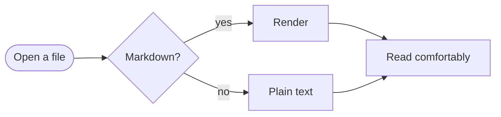

# Everything MD Viewer can render

This document exercises the full range of Markdown — CommonMark, the GitHub-flavored
extensions, and the extras modern documents use. It doubles as a quick reference:
press <kbd>Ctrl</kbd>+<kbd>B</kbd> to see the table of contents built from these
headings, and try <kbd>Ctrl</kbd>+<kbd>F</kbd> to search anything on this page.

> [!TIP]
> Everything you see here works in your own files. Open one with **Ctrl+O**, drop it
> onto the window, or use *Open with → MDView.exe* from Explorer.

## Inline styles

Text can be **bold**, *italic*, ***both***, ~~struck through~~, ==highlighted==,
++inserted++, or `inline code`. Chemistry works with subscripts like H~2~O, and
math-ish superscripts like E = mc^2^ render too. Smart typography turns straight
quotes into "curly ones", dashes into em-dashes — like this — and `(c)` into ©.

Abbreviations get hover definitions: the HTML spec is maintained by the WHATWG,
and styling is defined by CSS.

*[WHATWG]: Web Hypertext Application Technology Working Group
*[CSS]: Cascading Style Sheets

Emoji shortcodes work: :rocket: :tada: :sparkles: — and links come in every
flavor: [inline links](https://commonmark.org), autolinks like
<https://github.github.com/gfm/>, bare URLs such as https://katex.org, and
[reference-style links][ref]. Footnotes look like this[^first] and support
hover previews[^second].

[ref]: https://spec.commonmark.org "The CommonMark specification"

[^first]: Hover or focus a footnote marker to preview it without losing your place.
[^second]: Click it to jump down; the ↩ arrow brings you back.

## Headings

All six levels are rendered and become table-of-contents entries with deep-linkable
anchors (hover any heading to see its `#` link).

### Third level

#### Fourth level

##### Fifth level

###### Sixth level

## Lists

1. Ordered lists
2. Can nest anything:
   - Unordered children
   - With multiple items
     1. And deeper ordered lists
     2. Starting wherever you like
3. Loose or tight spacing is preserved

A separate list can start at any number:

57. This one starts at 57 —
58. and keeps counting from there.

- [x] Task lists render as real checkboxes
- [x] Checked and unchecked states
- [ ] Click one to check it off — updates the file when you save

Definition lists
: A term followed by its definition, from the `deflist` extension.

Markdown
: A plain-text format for writing structured documents, created in 2004.

## Block quotes and alerts

> Plain block quotes look like this.
>
> > They nest, too — with multiple paragraphs.

All five GitHub-style alerts are supported:

> [!NOTE]
> Useful information that users should know, even when skimming.

> [!TIP]
> Helpful advice for doing things better or more easily.

> [!IMPORTANT]
> Key information users need to know to achieve their goal.

> [!WARNING]
> Urgent info that needs immediate user attention to avoid problems.

> [!CAUTION]
> Advises about risks or negative outcomes of certain actions.

## Code

Inline `code spans` and fenced blocks with syntax highlighting for dozens of
languages. Hover a block for the copy button.

```python
def fibonacci(n: int) -> list[int]:
    """Return the first n Fibonacci numbers."""
    seq = [0, 1]
    while len(seq) < n:
        seq.append(seq[-1] + seq[-2])
    return seq[:n]

print(fibonacci(10))  # [0, 1, 1, 2, 3, 5, 8, 13, 21, 34]
```

```js
const debounce = (fn, ms = 200) => {
  let t;
  return (...args) => {
    clearTimeout(t);
    t = setTimeout(() => fn(...args), ms);
  };
};
```

```diff
- The old line that was removed
+ The new line that replaced it
  Context lines stay neutral
```

Indented code blocks work as well:

    This block is indented four spaces.
    No highlighting — exactly as written.

## Tables

| Feature          | Syntax            | Aligned  |    Notes |
| :--------------- | :---------------: | -------- | -------: |
| Column alignment | `:---:`           | left     |    right |
| Inline styles    | **bold**, `code`  | *italic* |  H~2~O ✓ |
| Wide tables      | scroll sideways   | keyboard | friendly |

## Math

Inline math like $e^{i\pi} + 1 = 0$ flows with the text. Display math gets its
own block, rendered by KaTeX with screen-reader-friendly MathML:

$$
\int_{-\infty}^{\infty} e^{-x^2}\,dx = \sqrt{\pi}
\qquad
\begin{pmatrix} a & b \\ c & d \end{pmatrix}^{-1}
= \frac{1}{ad-bc}\begin{pmatrix} d & -b \\ -c & a \end{pmatrix}
$$

Chemical equations render too, via mhchem:

$$\ce{2H2 + O2 -> 2H2O}$$

## Diagrams

Fenced ` ```mermaid ` blocks become diagrams, re-themed automatically for dark
mode:



## Images and media

Images scale to fit, lazy-load, and click-to-zoom. Relative paths in your own
documents resolve next to the file, exactly like on GitHub. This one is embedded
as a data URI:


In dark mode, images are gently dimmed for comfortable night reading (you can turn
that off in the **Aa** panel).

## Raw HTML

Because Markdown allows embedded HTML, MD Viewer renders a safe subset — scripts
and other active content are always stripped.

<details>
<summary>Collapsible sections via <code>&lt;details&gt;</code> — click to expand</summary>

Anything can live inside: **markdown**, <em>HTML</em>, even code blocks.

</details>

Keyboard keys: <kbd>Ctrl</kbd>+<kbd>F</kbd> · centered text works with
<div align="center">the classic <code>align</code> attribute</div>

## Horizontal rules

Three ways to draw a line:

---

***

___

## Escapes and edge cases

Literal characters when you need them: \*not italic\*, \`not code\`,
\# not a heading, and entities like &copy; &rarr; &hearts;. A line ending in two
spaces  
forces a hard break, like the one above.

That's the tour — open one of your own files with <kbd>Ctrl</kbd>+<kbd>O</kbd>,
and press <kbd>F1</kbd> whenever you need the shortcut list.
