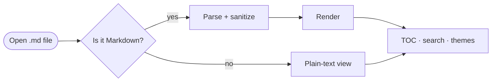
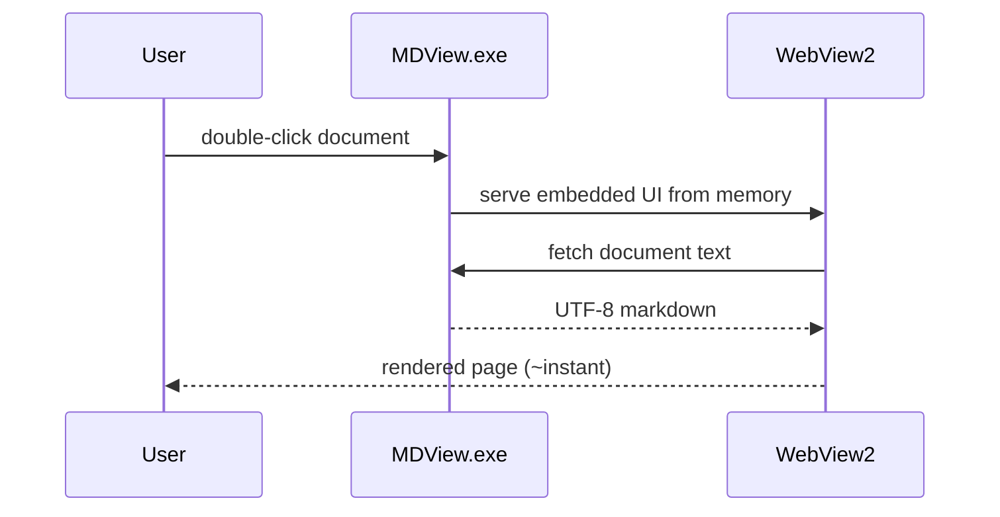
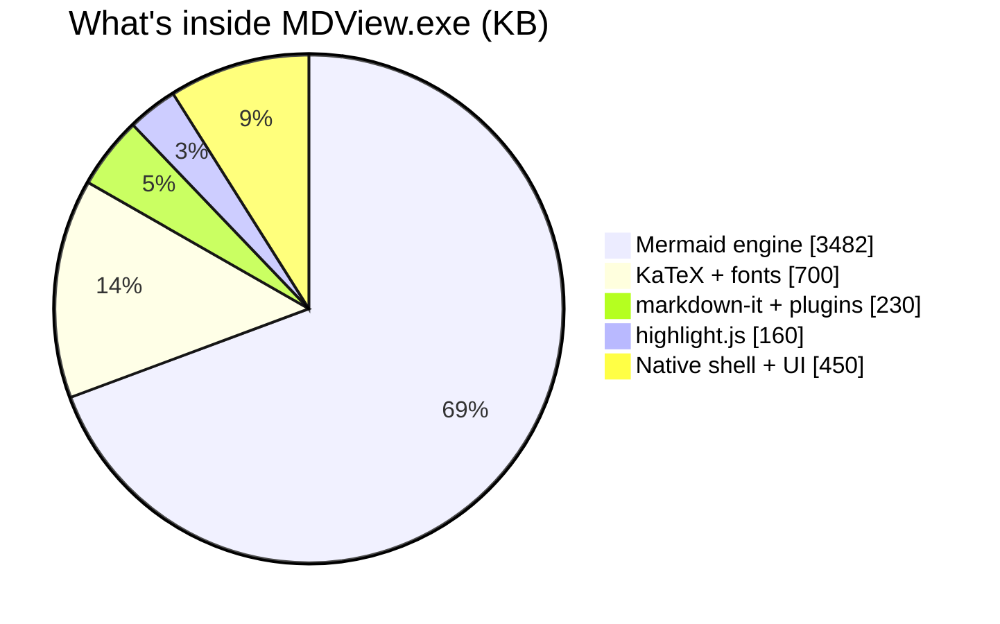
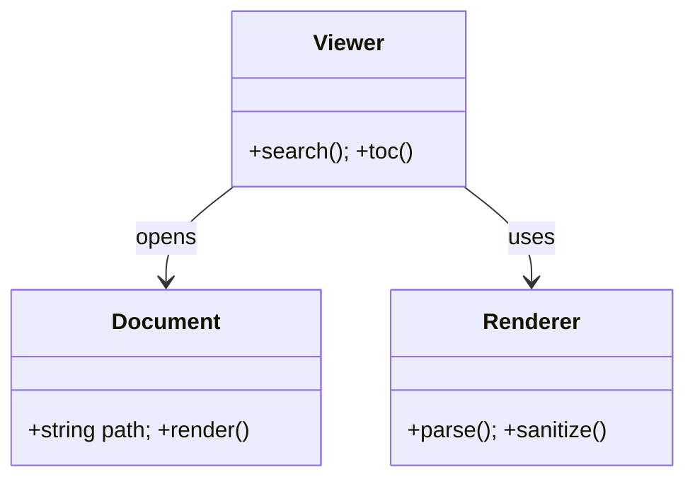

# The Complete Markdown Specimen

This document exercises **every feature Markdown is capable of** — the full
[CommonMark](https://spec.commonmark.org) core, every
[GitHub-flavored Markdown][gfm] extension, and the modern extras (math,
chemistry, diagrams, footnotes, definition lists) that contemporary documents
rely on. It doubles as a stress test: if something renders wrong here, it's a
bug. The YAML block above renders as collapsible *Document metadata*, and the
paragraph marker below becomes an inline table of contents.

[TOC]

## 1. Block structure

### 1.1 Headings

ATX headings run from `#` to `######`; the deeper ones are shown here so the
sidebar stays sane:

#### A fourth-level heading
##### A fifth-level heading
###### A sixth-level heading, the smallest ##

That last one uses optional *closing hashes*, which the spec ignores. The other
syntax is **setext**: underline text with `===` for level one or `---` for
level two.

A setext level-one heading, made with equals signs
===

Setext level two, made with dashes
---

Headings may contain `code`, *emphasis*, ~~strikethrough~~ and emoji :sparkles: —

### The *styled* ~~heading~~ `test` :rocket:

…and every heading gets a stable anchor: hover one and click `#` to link
straight to it. Two identical headings get de-duplicated anchors (see the
[Appendix](#appendix-anchor-collisions)).

### 1.2 Paragraphs and line breaks

A paragraph is just adjacent lines of text; this sentence and the previous one
share a line in the source but flow together because a single newline is a
*soft break*.
A hard break needs two trailing spaces —  
like that — or a backslash at the end of the line —\
like that.

### 1.3 Block quotes

> A simple block quote.
>
> It can span paragraphs,
continue lazily onto unmarked lines like this one,
> and contain any other block:
>
> 1. an ordered list,
> 2. with a nested quote:
>    > “Quotes in quotes in quotes.”
>    > — *Someone, probably*
>
> ```js
> const code = "inside a quote";
> ```

### 1.4 Lists

Unordered lists accept `-`, `+`, or `*` as markers; ordered lists accept `.`
or `)` after the number and start wherever they like.

- Dash marker
  + Plus marker, nested
    * Star marker, nested deeper
      - [ ] Even a task, four levels down
- Items can hold **multiple blocks**:

  A second paragraph, indented to stay in the item.

      an indented code block inside the item

  > and a block quote too.

1) Ordered with a parenthesis delimiter
2) Second item

A separate list starting at one thousand:

1000. Numbering is preserved
1001. exactly as written

### 1.5 Task lists

- [x] Render checkboxes (read-only, like GitHub)
- [x] Support nesting
  - [x] child done
  - [ ] child pending
- [ ] Never lose your place

### 1.6 Definition lists

Term one
: The first definition of the term.
: A second definition for the same term.

Markdown
: A plain-text writing format created in 2004, standardized by CommonMark
  in 2014, and extended ever since.

### 1.7 Code blocks

Fenced with backticks and an *info string* for highlighting:

```python
from dataclasses import dataclass

@dataclass
class Reader:
    """Every good format deserves a good reader."""
    name: str = "MD Viewer"
    features: int = 0xFF

print(f"{Reader().name} loads in milliseconds")
```

Fenced with tildes instead:

~~~text
Tilde fences (~~~) are part of the spec too.
~~~

Indented four spaces (the original 2004 syntax):

    10 PRINT "STILL WORKS"
    20 GOTO 10

And a four-backtick fence, so it can *contain* a three-backtick fence:

````markdown
```js
console.log("a fence inside a fence");
```
````

### 1.8 Thematic breaks

Three ways (hyphens, asterisks, underscores — spaces allowed):

---

* * *

___

### 1.9 Tables

| Syntax | Alignment | Rendered | Notes |
| :----- | :-------: | -------- | ----: |
| `:---` | left | plain text | 1 |
| `:---:` | center | **bold**, *italic*, `code` | 22 |
| `---:` | right | $e^{i\pi}=-1$ and :tada: | 333 |
| escaped pipe | center | a \| b | 4,444 |

A deliberately wide table to prove horizontal scrolling (it's keyboard-scrollable
and announced as a region to screen readers):

| Col 1 | Col 2 | Col 3 | Col 4 | Col 5 | Col 6 | Col 7 | Col 8 | Col 9 | Col 10 |
| ----- | ----- | ----- | ----- | ----- | ----- | ----- | ----- | ----- | ------ |
| alpha | bravo | charlie | delta | echo | foxtrot | golf | hotel | india | juliett |

Markdown tables can't merge cells — but raw HTML can:

<table>
  <tr><th colspan="3">A raw-HTML table with merged cells</th></tr>
  <tr><td rowspan="2">spans two rows</td><td>b1</td><td>c1</td></tr>
  <tr><td>b2</td><td>c2</td></tr>
</table>

### 1.10 Raw HTML blocks

Markdown's escape hatch is HTML itself. A safe subset renders (scripts, frames
and forms are always stripped):

<details>
<summary>Collapsible <code>&lt;details&gt;</code> — click or press Enter</summary>

Everything works inside: **markdown**, math $x^2$, even a list:

- one
- two

</details>

<figure>
  
  <figcaption>A real <code>&lt;figure&gt;</code> with a <code>&lt;figcaption&gt;</code>.</figcaption>
</figure>

<p dir="rtl" lang="ar">هذه الفقرة مكتوبة من اليمين إلى اليسار لاختبار النص ثنائي الاتجاه.</p>

<p><ruby>漢字<rt>かんじ</rt></ruby> — ruby annotations for East-Asian phonetics.</p>

<!-- This HTML comment must be invisible in the rendered page. -->

## 2. Inline syntax

### 2.1 Emphasis in every flavor

*single asterisks*, _single underscores_, **double asterisks**,
__double underscores__, ***bold italic***, **bold with _nested italic_**,
*italic with **nested bold***, ~~struck through~~, and per the spec,
intraword underscores in snake_case_identifiers do **not** trigger emphasis,
while intraword asterisks (un*frigging*believable) do.

> [!NOTE]
> Strikethrough here requires **double** tildes (`~~text~~`). A *single* tilde
> is reserved for subscripts (`H~2~O`, see §2.5), so `~text~` renders as a
> subscript rather than GitHub's single-tilde strikethrough — a deliberate
> trade to support scientific notation.

### 2.2 Code spans

Inline `code`, a span containing backticks — `` `ticks` `` — and a literal
backtick alone: `` ` ``.

### 2.3 Every kind of link

[Inline](https://commonmark.org), [inline with a *title* — hover me](https://commonmark.org "The CommonMark spec"),
[angle-bracket destination](<https://example.com/a path with spaces>),
[full reference][gfm], [collapsed reference][], shortcut reference: [CommonMark],
autolink: <https://spec.commonmark.org/0.31.2/>, bare-URL linkification:
https://katex.org and www.example.com, angle-bracket email:
<viewer@example.com>, bare email autolink: support@example.com,
an [anchor link to §4](#4-international-text), and a
[relative link to this very file](sample.md) (opens right here).

### 2.4 Images

Inline, reference-style, linked, and data-URI images — with lazy loading and
click-to-zoom:


[](https://commonmark.org)

![Reference-style image][refimg]

### 2.5 The extended inline set

~~deleted~~, ==highlighted==, ++inserted++, H~2~O subscripts,
E=mc^2^ superscripts, and semantic HTML inlines: <q>quoted speech</q>,
<cite>The CommonMark Spec</cite>, <var>x</var> = <samp>42</samp>,
a <dfn>definition</dfn>, <small>small print</small>, <u>underline</u>,
<del>deleted</del>/<ins>inserted</ins>, and keys like
<kbd>Ctrl</kbd>+<kbd>F</kbd>.

### 2.6 Abbreviations

The HTML spec is maintained by the WHATWG; styling comes from CSS, scripting
from JS. Hover any of them for the expansion.

*[WHATWG]: Web Hypertext Application Technology Working Group
*[CSS]: Cascading Style Sheets
*[JS]: JavaScript

### 2.7 Escapes and entities

Backslashes neutralize syntax: \*not emphasis\*, \`not code\`, \# not a
heading, \[not a link\], \> not a quote, \| not a table.
Entities in all three forms: named &copy; &rarr; &hearts;, decimal &#169;,
hex &#xA9; — and a raw ampersand & just works.

### 2.8 Smart typography

Straight quotes become "curly," 'even singles,' three dots… become an
ellipsis, dashes upgrade -- to en and --- to em, and (c) (tm) (r) become
© ™ ®.

### 2.9 Emoji

Shortcodes — :rocket: :tada: :sparkles: :warning: :heart: — and raw Unicode
🦖 🌋 🛰️ both render.

### 2.10 Footnotes

Numbered footnotes[^1], named footnotes[^spec], **inline** footnotes^[Defined
right in the sentence, no separate definition needed.], and multi-paragraph
footnotes[^long]. Hover any marker for a preview; click to jump; ↩ returns.

[^1]: The simplest kind.
[^spec]: Labels can be words — the label never shows, only the number. Emoji work in footnotes too :sparkles:
[^long]: A footnote with multiple blocks.

    Indented content belongs to the footnote, including this second paragraph.

## 3. Rich content

### 3.1 Mathematics

Inline math flows with text: the identity $e^{i\pi} + 1 = 0$, a sum
$\sum_{k=1}^{n} k = \frac{n(n+1)}{2}$, and prices like $5 or $10 are left
alone. Display math gets `$$`:

$$
\underbrace{\begin{pmatrix} \cos\theta & -\sin\theta \\ \sin\theta & \cos\theta \end{pmatrix}}_{\text{rotation}}
\qquad
f(x) = \begin{cases} x^2 & x \ge 0 \\ -x & x < 0 \end{cases}
$$

GitHub-style ```` ```math ```` fences work too:

```math
\mathcal{L}\{f\}(s) = \int_0^\infty f(t)\, e^{-st}\, dt
\qquad
\nabla \times \mathbf{B} = \mu_0 \mathbf{J} + \mu_0\varepsilon_0 \frac{\partial \mathbf{E}}{\partial t}
```

Even chemistry, via mhchem:

$$\ce{2H2(g) + O2(g) ->[\text{spark}] 2H2O(l)} \qquad \ce{SO4^2- + Ba^2+ -> BaSO4 v}$$

### 3.2 Diagrams (Mermaid)

Flowcharts:



Sequence diagrams:



Statistical charts:



Class diagrams:



And Gantt timelines (each family uses a different Mermaid sub-renderer and
theme path, so all are worth exercising):

```mermaid
gantt
    title Build pipeline
    dateFormat  HH:mm
    axisFormat  %H:%M
    section Native
    Compile main.cpp   :a1, 00:00, 3m
    Link WebView2      :after a1, 1m
    section Assets
    Bundle resources   :00:00, 2m
```



### 3.3 Syntax-highlighting gallery

```c
typedef struct HedEntry {   /* fixed 0x50-byte records */
    char name[0x40];
    u32  offset, size, id, blocks;
} HedEntry;
```

```rust
fn main() -> Result<(), Box<dyn std::error::Error>> {
    let doc = std::fs::read_to_string("sample.md")?;
    println!("{} bytes of markdown", doc.len());
    Ok(())
}
```

```typescript
interface Feature { name: string; supported: true }   // no `false` allowed
const features: Feature[] = await (await fetch("/api/features")).json();
```

```powershell
Get-Item .\MDView.exe -Stream * |
    Where-Object Stream -ne ':$DATA' |
    ForEach-Object { "{0}: {1} bytes" -f $_.Stream, $_.Length }
```

```bat
@echo off
for %%f in (*.md) do MDView.exe "%%f"
```

```dockerfile
FROM alpine:3.20 AS docs
COPY *.md /srv/docs/
CMD ["cat", "/srv/docs/sample.md"]
```

```sql
SELECT name, COUNT(*) AS uses
FROM features
WHERE supported = TRUE
GROUP BY name
HAVING COUNT(*) > 0
ORDER BY uses DESC;
```

```x86asm
render:  push rbp
         mov  rbp, rsp
         lea  rdi, [rel markdown]
         call parse
         leave
         ret
```

```diff
--- a/viewer.md
+++ b/viewer.md
-The old line, removed.
+The new line, added.
 Context stays put.
```

```json
{ "viewer": "MDView", "deps": 0, "installers": 0, "telemetry": null }
```

```yaml
viewer: MDView
storage:
  registry: false
  appdata: false
  ads-streams: [mdv.settings, mdv.window]
```

```html
<article class="markdown-body" lang="en">
  <h1 id="title">Rendered &amp; sanitized</h1>
</article>
```

```css
.markdown-body :focus-visible { outline: 2px solid var(--accent); }
```

```nginx
location /docs/ { types { text/markdown md; } autoindex on; }
```

```cmake
add_executable(mdview WIN32 src/main.cpp src/app.rc)
target_compile_options(mdview PRIVATE /utf-8 /O2)
```

An unknown info string falls back to plain code, exactly as it should:

```unknownlang
fences with unknown languages render as plain code
```

### 3.4 Alerts

> [!NOTE]
> Useful information users should know, even when skimming.

> [!TIP]
> Helpful advice for doing things better or more easily.

> [!IMPORTANT]
> Key information users need to know to achieve their goal.

> [!WARNING]
> Urgent info that needs immediate attention to avoid problems.

> [!CAUTION]
> Advises about risks or negative outcomes of certain actions.

### 3.5 Embedded media

A `<video>` element with a `poster` frame (the poster path resolves next to
this file, just like relative images); with no video source it shows the poster:

<video controls width="320" poster="test-image.png"></video>

And a 0.2-second sine beep, embedded entirely as a data URI (audio and video
tags with local or embedded sources both work):

<audio controls src="data:audio/wav;base64,UklGRgQHAABXQVZFZm10IBAAAAABAAEAQB8AAEAfAAABAAgAZGF0YeAGAACAgICAgICAf35+fn5/gYKCgoGAfn18fH1/gYOEhIOAfnt6ent+goWGhoSBfXp4eHp9goaIiIaCfXl2dXh8goeKi4iDfXh0c3Z7gYiMjYqFfndycXN5gYiNj42Hf3dxb3F3gIiPkY+JgHdwbW91f4iQk5GLgXdva2xzfYiRlZSNg3duaWpxe4iSl5aQhHhtZ2dueoeSmZmSh3ltZWVrd4aSmpuViXptZGNpdYSSnJ6Yi3xtY2BmcoOSnaCajn1tYl5jcIGRnqKdkYBuYVxgbX6QnqSglIJvYVpdanyPnqajl4RxYFhbZ3mOn6emmodyYVdYY3aMnqmonYp0YVZVYHOKnqqroI12YlVTXXCHnautpJF5Y1RRWm2FnKuwp5R8ZFNOVmmCmqyyqph/ZlNMU2V/mKyzrpuCaFNLUGJ7lqu1sZ+FalRJTV54lKu2tKOJbFVISlp0kaq3tqeNb1ZHR1Zwjqm4uauRcldHRVJsi6e5vK+VdllGQk9oh6W5vrKZeltGQEtjhKO5wLaefV5HPkdff6C4wbmigmBHPURbe523w72mhmRIPEFWd5q2xMCrimdKOz5Scpa0xcOvj2tMOjtObpKyxcWzlG9OOjhJaY6wxci4mXNQOjZFZIqtxcq8nXdTOzRBX4WqxMzAonxWOzI+WoGnw83Dp4FaPTE6VXyjws/HrIZePjA3UHefwM/KsYtiQC80THKbvtDNtpBmQy8xR2yXu9DQupVrRS8uQmeSuNDSv5twSTAsPmGNtc/Uw6B1TDEqOlyIsc7Wx6Z6UDIpNleCrczXy6uAVDQnMlF9qcrYzrCFWDYnL0x3pMjY0rWLXTgmLEdxn8XZ1bqQYjsmKUJsmsLY17+WZz8nJz5mlb/Y2sScbUIoJDlgj7vW28iickYpIzVairfV3cyneEsrIjFVhLLT3tCtfk8tIS1Pfq3R39SzhFQwICpKeKjO39e4ilkzICdFcqPL39q9kF82ICQ/bJ3H3tzClmQ6ISI7ZpjD3d7HnGo+IyA2YJK/3ODLonBCJB4yWoy72uHPqHZHJh0uVIa21+LTrnxMKR0qTn+x1ePWs4NRLBwnSXmr0uPZuYlXLx0kRHOmzuLcvo9cMx0iP22gyuHew5ViNx4gOmeaxuDgx5toOyAeNmGUwt7izKFuQCIdMVuOvdzjz6d1RSQcLlWHuNnj0617SiccKk+Bstbj1rKBTyocJ0p7rdPj2biHVS4cJUV1p8/i3L2OWzIdIkBuocvh3sGUYTYfITtom8fg38aaZzogHzdilcLe4MqgbT8jHjNdj73b4c2lc0QlHjBXibjY4dGreUooHi1Sg7PV4dSwgE8rHipNfK3S4da1hlUvHyhIdqfO4Ni6jFszICZDcKLK3tq+kmA3ISQ/a5zF3dvCl2Y8JCM7ZZbB2tzGnWxBJiM4X5C82N3JonJGKSI0Woq31d3Mp3hLLCIyVYSx0tzPrH5QLyMvUX6sztvRsYRWMyQtTHimytrStYlbNyYsSHOhxtnUuY9hOycrRG2bwtfVvJRnQCoqQWiVvdTVwJlsRCwqPmOQuNLVw55ySS8qO16Ks8/VxaN3TjIqOVqFrsvUx6d9UzUrN1Z/qcjTyauCWDksNVJ6pMTSyq+HXj0uNE51n8DQy7KMY0EwNEtwmrzOzLWRaEUyM0hslLfMzLiVbUo1M0Znj7PJzLqack44NERjiq7Gy7yed1M7NEJgharDyr6hfFg+NkFcgaW/yb+lgVxCN0BZfKC8x8CohWFFOT9WeJu4xcCqiWZJOz9TdJe0w8CtjWpNPT9RcJKwwMCvkW9RQD9PbI6svr+wlXNVQ0BOaYqou7+ymHhaRkFNZoWjuL2zm3xeSUJMY4GftbyznYBiTERLYX6bsbq0oINmUEZLXnqXrri0oYdqU0hMXXeTqrazo4puV0pMW3SPprOzpI1yWk1NWnGMo7GypY91XlBOWW+In66wppJ5YlNPWWyFnKuvppR8ZVVRWWqCmKitppV/aVhTWWl/laWrppeCbFxVWWh8kaKpppiEb19XWmd6jp+npZmGcmJZW2Z4i5ylpJmIdWVcXGZ2iZmiopmKeGheXWZ0hpafoZmLemthX2ZzhJOdn5mMfW5kYWZygZCanZiNf3BmY2dxf42Xm5iOgHNpZWhxfouVmZeOgnVrZ2lxfImSl5WOg3duaWtxe4eQlJSOhHlxbGxye4WNkpKNhXtzbm5yeoOLkJCMhX11cHBzeoKJjY6LhX53c3J0eoGHi4yKhX95dXR2eoCFiYqJhYB7d3Z3e3+Eh4iHhIB8eXh5e3+ChYaFg4B9e3p7fH+Bg4SDgoB+fXx9fn+AgYKBgYB/f35/f3+AgA=="></audio>

## 4. International text

Markdown is encoding-agnostic; the viewer normalizes UTF-8/UTF-16 and renders
every script the OS can shape:

- **CJK** — 简体中文、繁體中文、日本語（ルビ付き）、한국어 모두 정상 표시
- **RTL** — العربية and עברית flow right-to-left (full paragraph in §1.10)
- **Combining marks** — Z̷̢̈a̶͍͠l̸̠̈g̸̙̈o̷̪͝ text and naïve café résumé
- **Emoji in structure** — tables :white_check_mark:, headings :white_check_mark:, footnotes :white_check_mark:

## 5. Edge cases and spec trivia

####### Seven hashes is *not* a heading — the spec caps at six, so this line is a paragraph.

1\. An escaped digit-dot is not a list item.

A leading **tab** opens an indented code block (a tab advances to the next
4-column stop):

	tab-indented code — one real tab, not spaces

Bracket-delimited math (`\(…\)` and `\[…\]`, the Pandoc/Typora form) is
intentionally **not** enabled here: those delimiters collide with CommonMark's
backslash escapes (the `\[like these\]` below must stay literal), and GitHub
doesn't support them either — use $…$, $$…$$, or a fenced `math` block.

A URL in angle brackets with an ampersand — <https://example.com/?a=1&b=2> —
keeps its query intact, `<!-- comments -->` vanish (there's an invisible one in
§1.10), an empty link [](https://example.com) still links, and unmatched
brackets [like these] just stay text. Fences with more backticks can quote
fences with fewer (see §1.7), and `` `code spans` `` protect *everything*
inside them: `*not italic*`, `[not](a-link)`, `$not math$`.

## Appendix: anchor collisions

### The same heading twice

First occurrence.

### The same heading twice

Second occurrence — its anchor gets a `-1` suffix, so TOC links stay unique.

---

*That's the complete specimen. If a Markdown document renders somewhere else
but not here, that's a bug worth reporting.*

[gfm]: https://github.github.com/gfm/ "The GFM specification"
[collapsed reference]: https://daringfireball.net/projects/markdown/
[CommonMark]: https://commonmark.org
[refimg]: data:image/svg+xml;base64,PHN2ZyB4bWxucz0iaHR0cDovL3d3dy53My5vcmcvMjAwMC9zdmciIHdpZHRoPSIyNDAiIGhlaWdodD0iNjAiIHZpZXdCb3g9IjAgMCAyNDAgNjAiPjxyZWN0IHdpZHRoPSIyNDAiIGhlaWdodD0iNjAiIHJ4PSIxMCIgZmlsbD0iIzFhN2YzNyIvPjx0ZXh0IHg9IjEyMCIgeT0iMzgiIGZvbnQtZmFtaWx5PSJTZWdvZSBVSSwgc2Fucy1zZXJpZiIgZm9udC1zaXplPSIyMCIgZm9udC13ZWlnaHQ9IjYwMCIgZmlsbD0iI2ZmZiIgdGV4dC1hbmNob3I9Im1pZGRsZSI+cmVmZXJlbmNlIGltYWdlPC90ZXh0Pjwvc3ZnPg== "A reference-defined image"
